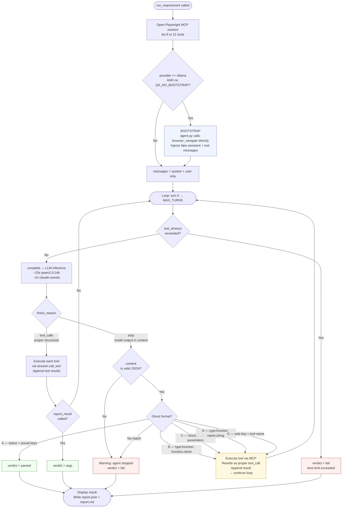

# Executor flow — turns, bootstrap, MCP tools

## Key concepts

### Turn

A **turn** = one complete cycle: `agent.py` sends the accumulated message history to the LLM → LLM responds with one action.

Triggered by `agent.py` inside `for turn in range(MAX_TURNS)` — specifically by the `complete(config, messages, tools)` call, which is a single HTTP request to the LLM provider (Ollama or Anthropic).

The LLM does not know turns exist. It receives the full `messages[]` list accumulated so far and responds with the next action. Each tool call adds 2 new messages (`assistant` + `tool` result), so the context grows with every turn.

**Cost on M4 Pro:**
- `qwen2.5:14b` → ~23s/turn
- `qwen2.5:7b` → ~15s/turn  
- `claude-sonnet-4-6` → ~2s/turn

### Bootstrap

**Bootstrap** = an action pre-executed by `agent.py` *before* the LLM loop starts, by calling Playwright MCP directly (no LLM involved).

Without bootstrap the LLM starts with an empty page context and must initiate the first tool call itself. Small Ollama models struggle with this — they hallucinate verdicts or output test plans instead of calling `browser_navigate`.

Bootstrap injects a fake completed turn into `messages[]` so the LLM starts mid-stream:

```
Without bootstrap — messages at turn 0:
  [system]
  [user: "test GB-001, URL: https://..."]

With bootstrap — messages at turn 0:
  [system]
  [user: "test GB-001, URL: https://..."]
  [assistant: tool_call(browser_navigate, url)]   ← injected by agent.py, no LLM
  [tool: "Navigated to https://..."]              ← injected by agent.py, no LLM
```

The LLM sees navigation as already done and responds with `browser_snapshot` as its first action — saving 1–2 wasted turns.

Active only for `provider == "ollama"`. Disable with `QA_NO_BOOTSTRAP=true`.

### Playwright MCP tools

The `@playwright/mcp` Node process exposes 21 browser automation tools over the MCP protocol. `agent.py` connects to it via `stdio_client` and can call any tool via `session.call_tool(name, args)`.

| Tool | What it does |
|------|-------------|
| `browser_navigate` | Opens a URL in headless Chromium — equivalent to `page.goto(url)` |
| `browser_snapshot` | Returns the page's accessibility tree as structured text, with element refs (`e32`, `e77`, …) that other tools use |
| `browser_click` | Clicks an element by ref |
| `browser_type` | Types text into a focused input |
| `browser_fill_form` | Fills multiple form fields at once |
| `browser_wait_for` | Waits for a text string to appear or for a fixed duration |
| `browser_press_key` | Sends a keyboard event |
| `browser_select_option` | Selects a dropdown option |

The LLM never calls these directly — it outputs a tool name + arguments (either as a structured `tool_calls` response or as a ghost JSON in `content`). `agent.py` reads that, calls `session.call_tool()`, and feeds the result back as the next `tool` message.

**Slim mode** (default for Ollama): only the 8 tools above are exposed. Reduces hallucination on small models. Full mode (21 tools) enabled with `QA_FORCE_SLIM=false`.

---

## Full executor flow



---

## Why tests with `When` take longer

Requirements with a `When` clause (e.g. *"click the PLAY button"*) need the model to:
1. See the page (take a snapshot to learn refs)
2. Click the target element by ref
3. Observe the result (take another snapshot)
4. Verify and report

Current bootstrap only injects `browser_navigate`. The model starts without page context, so turn 0 is typically a guess or a wait — wasting 2–3 turns before it finds the correct ref from a snapshot.

**Proposed fix:** extend bootstrap to also execute `browser_snapshot` when the requirement has a non-empty `When` field, giving the model both navigation and initial page state before turn 0.
